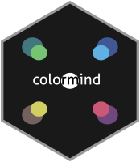

<!-- README.md is generated from README.Rmd. Please edit that file -->

```{r, include = FALSE}
knitr::opts_chunk$set(
  collapse = TRUE,
  comment = "#>",
  fig.path = "man/figures/README-",
  out.width = "100%"
)
```

# colormind <a href='https://dmi3kno.github.io/colormind'></a>

<!-- badges: start -->
[](https://www.tidyverse.org/lifecycle/#experimental)
<!-- badges: end -->

The goal of `colormind` is to assist in generating aestetically pleasing color scales using [colormind.io](http://colormind.io) palette generator.

## Installation

You can install the development version of `colormind` from [Github](https://github.com) with:

``` r
remotes::install_github("dmi3kno/colormind")
```

## Example

Colormind.io is a color scheme generator that uses deep learning. It can learn color styles from photographs, movies, and popular art. Check [colormind.io](http://colormind.io) for currently loaded color models (sample palettes) or retrieve them directly into your R session with `get_colormind_models()`. Color models get updated daily.

```{r example}
library(colormind)
## basic example code
mods <- get_colormind_models()
mods
```

Here's randomly generated palette using "default" colormodel.

```{r}
colp <- get_colormind_colors()
scales::show_col(colp, borders = NA)
```

You can also "seed" palette with your own colors. In order to do that, you need to pass a color vector (maximum length 5) with some values filled in. If you want something closer to diverging palette, you might want to try placing your suggested colors to opposite ends of a vector. 

```{r pressure}
colp <- c("#006494", NA, NA, NA, "#dc493a")
scales::show_col(colp, borders = NA)
```

The missing values in your vector will be complemented by colormind.io using current colormodel. 

```{r}
colr <- get_colormind_colors(colp, "default")
scales::show_col(colr, borders = NA)
```

Colors are randomised every time you hit an API, so you may try it several times, or try another colormodel.

```{r}
library(purrr)
slow_get_colormind_colors <- slowly(get_colormind_colors, rate = rate_delay(3))

walk(mods, ~slow_get_colormind_colors(colp, model=.x) %>% 
           scales::show_col(borders = NA))

```

